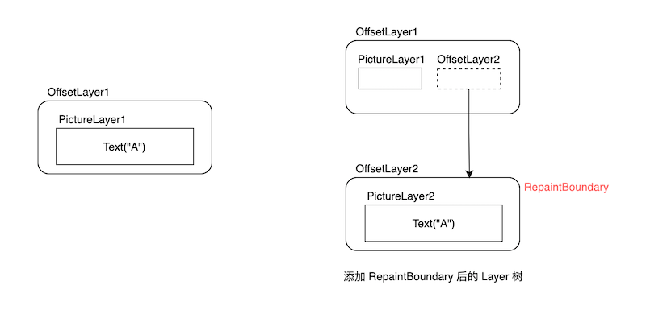

# 14.8 绘制（四）Compositing

本节我们来介绍一下 flushCompositingBits()。现在，我们再来回顾一下Flutter的渲染管线：

```dart
void drawFrame(){
  pipelineOwner.flushLayout();
  pipelineOwner.flushCompositingBits();
  pipelineOwner.flushPaint();
  renderView.compositeFrame()
  ...//省略  
} 
```

其中只有 flushCompositingBits() 还没有介绍过，这是因为要理解flushCompositingBits()，就必须的了解Layer是什么，以及 Layer 树构建的过程。为了更容易理解它，我们先看一个demo。

## 14.8.1 CustomRotatedBox

我们实现一个CustomRotatedBox，它的功能是将其子元素放倒（顺时针旋转 90 度），要实现个效果我们可以直接使用 canvas 的变换功能，下面是核心代码：

```dart
class CustomRotatedBox extends SingleChildRenderObjectWidget {
  CustomRotatedBox({Key? key, Widget? child}) : super(key: key, child: child);

  @override
  RenderObject createRenderObject(BuildContext context) {
    return CustomRenderRotatedBox();
  }
}

class CustomRenderRotatedBox extends RenderBox
    with RenderObjectWithChildMixin<RenderBox> {

  @override
  void performLayout() {
    _paintTransform = null;
    if (child != null) {
      child!.layout(constraints, parentUsesSize: true);
      size = child!.size;
      //根据子组件大小计算出旋转矩阵
      _paintTransform = Matrix4.identity()
        ..translate(size.width / 2.0, size.height / 2.0)
        ..rotateZ(math.pi / 2) // 旋转90度
        ..translate(-child!.size.width / 2.0, -child!.size.height / 2.0);
    } else {
      size = constraints.smallest;
    }
  }

  @override
  void paint(PaintingContext context, Offset offset) {
    if(child!=null){
       // 根据偏移，需要调整一下旋转矩阵
        final Matrix4 transform =
          Matrix4.translationValues(offset.dx, offset.dy, 0.0)
            ..multiply(_paintTransform!)
            ..translate(-offset.dx, -offset.dy);
      _paint(context, offset, transform);
    } else {
      //...
    }
  }
  
 void _paint(PaintingContext context,Offset offset,Matrix4 transform ){
    // 为了不干扰其他和自己在同一个layer上绘制的节点，所以需要先调用save然后在子元素绘制完后
    // 再调用restore显示，关于save/restore有兴趣可以查看Canvas API doc
    context.canvas
      ..save()
      ..transform(transform.storage);
    context.paintChild(child!, offset);
    context.canvas.restore();
  }
  ... //省略无关代码
}


```

下面我们写个demo测试一下：

```dart
class CustomRotatedBoxTest extends StatelessWidget {
  const CustomRotatedBoxTest({Key? key}) : super(key: key);

  @override
  Widget build(BuildContext context) {
    return Center(
      child: CustomRotatedBox(
        child: Text(
          "A",
          textScaleFactor: 5,
        ),
      ),
    );
  }
}
```

运行效果如图14-17，A被成功放倒了：


现在我们给 CustomRotatedBox 添加一个 RepaintBoundary 再试试：

```dart
@override
Widget build(BuildContext context) {
  return Center(
    child: CustomRotatedBox(
      child: RepaintBoundary( // 添加一个 RepaintBoundary
        child: Text(
          "A",
          textScaleFactor: 5,
        ),
      ),
    ),
  );
}
```

运行后如图14-18。咦，A怎么又站起来了！


结合图说明！

我们来分析一下原因：根据上一节的知识，我们可以很容易画出添加 RepaintBoundary 前和后的 Layer 树结构，如图14-19：



添加 RepaintBoundary 后，CustomRotatedBox 中的持有的还是 OffsetLayer1 ：

```dart
 void _paint(PaintingContext context,Offset offset,Matrix4 transform ){
    context.canvas // 该 canvas 对应的是 PictureLayer1 
      ..save()
      ..transform(transform.storage);
    // 子节点是绘制边界节点，会在新的 OffsetLayer2中的 PictureLayer2 上绘制
    context.paintChild(child!, offset); 
    context.canvas.restore();
  }
  ... //省略无关代码
}
```

很显然，CustomRotatedBox 中进行旋转变换的 canvas 对应的是 PictureLayer1，而 Text("A") 的绘制是使用的PictureLayer2 对应的 canvas ，他们属于不同的 Layer。可以发现父子的 PictureLayer "分离了"，所以CustomRotatedBox 也就不会对 Text("A")  起作用。那么如何解决这个问题的思路呢？

我们在前面的小节介绍过，有很多容器类组件都附带变换效果，拥有旋转变换的容器类Layer是 TransformLayer，那么我们就可以在 CustomRotatedBox 中绘制子节点之前：

1. 创建一个TransformLayer（记为 TransformLayer1） 添加到 Layer树中，接着创建一个新的 PaintingContext 和 TransformLayer1绑定。
2. 子节点通过这个新的 PaintingContext 去绘制。

完成上述操作之后，后代节点绘制所在的 PictureLayer 都会是 TransformLayer 的子节点，因此我们可以通过 TransformLayer 对所有子节点整体做变换。图14-20是添加是 TransformLayer1前、后的 Layer 树结构。


这其实就是一个重新 **Layer 合成（layer compositing）** 的过程：创建一个新的 ContainerLayer，然后将该ContainerLayer 传递给子节点，这样后代节点的Layer必然属于ContainerLayer ，那么给这个 ContainerLayer 做变换就会对其全部的子孙节点生效。因为 “Layer 合成” 在不同的语境会有不同的指代，为了便于描述，本节中 “layer 合成” 或 “合成 layer” 就特指上述过程。

> “Layer 合成” 在不同的语境会有不同的指代，比如 skia 最终渲染时也是将一个个 layer 渲染出来，这个过程也可以认为是多个 layer 上的绘制信息合成为最终的位图信息；另外 canvas 中也有 layer 的概念（canvas.save 方法生成新的layer），对应的将所有layer 绘制结果最后叠加在一起的过程也可以成为 layer 合成。

下面我们看看具体代码实现。由于 Layer 的组合是一个标准的过程（唯一的不同是使用哪种ContainerLayer来作为父容器），PantingContext 中提供了一个 pushLayer 方法来执行组合过程，我们看看其实现源码：

```dart
void pushLayer(ContainerLayer childLayer, PaintingContextCallback painter, Offset offset, { Rect? childPaintBounds }) {
  
  if (childLayer.hasChildren) {
    childLayer.removeAllChildren();
  }
  //下面两行是向Layer树中添加新Layer的标准操作，在之前小节中详细介绍过，忘记的话可以去查阅。
  stopRecordingIfNeeded();
  appendLayer(childLayer);
  
  //通过新layer创建一个新的childContext对象
  final PaintingContext childContext = 
    createChildContext(childLayer, childPaintBounds ?? estimatedBounds);
  //painter是绘制子节点的回调，我们需要将新的childContext对象传给它
  painter(childContext, offset);
  //子节点绘制完成后获取绘制产物，将其保存到PictureLayer.picture中
  childContext.stopRecordingIfNeeded();
}
```

那么，我们只需要创建一个 TransformLayer 然后指定我们需要的旋转变换，然后直接调用 pushLayer 可以：

```dart
// 创建一个持有 TransformLayer 的 handle.
final LayerHandle<TransformLayer> _transformLayer = LayerHandle<TransformLayer>();

void _paintWithNewLayer(PaintingContext context, Offset offset, Matrix4 transform) {
    //创建一个 TransformLayer，保存在handle中
    _transformLayer.layer = _transformLayer.layer ?? TransformLayer();
    _transformLayer.layer!.transform = transform;
    
    context.pushLayer(
      _transformLayer.layer!,
      _paintChild, // 子节点绘制回调；添加完layer后，子节点会在新的layer上绘制
      offset,
      childPaintBounds: MatrixUtils.inverseTransformRect(
        transform,
        offset & size,
      ),
    );
 }

 // 子节点绘制回调 
 void _paintChild(PaintingContext context, Offset offset) {
   context.paintChild(child!, offset);
 }
```

然后我们需要在 paint 方法中判断一下子节点是否是绘制边界节点，如果是则需要走layer组合，如果不是则需要 走 layer 合成：

```dart
 @override
 void paint(PaintingContext context, Offset offset) {
    if (child != null) {
      final Matrix4 transform =
          Matrix4.translationValues(offset.dx, offset.dy, 0.0)
            ..multiply(_paintTransform!)
            ..translate(-offset.dx, -offset.dy);
      
      if (child!.isRepaintBoundary) { // 添加判断
        _paintWithNewLayer(context, offset, transform);
      } else {
        _paint(context, offset, transform);
      }
    } else {
      _transformLayer.layer = null;
    }
 }
```

为了让代码看起看更清晰，我们将child不为空时的绘制逻辑逻辑封装一个 `pushTransform `函数里：

```dart
  TransformLayer? pushTransform(
    PaintingContext context,
    bool needsCompositing,
    Offset offset,
    Matrix4 transform,
    PaintingContextCallback painter, {
    TransformLayer? oldLayer,
  }) {
    
    final Matrix4 effectiveTransform =
        Matrix4.translationValues(offset.dx, offset.dy, 0.0)
          ..multiply(transform)
          ..translate(-offset.dx, -offset.dy);
    
    if (needsCompositing) {
      final TransformLayer layer = oldLayer ?? TransformLayer();
      layer.transform = effectiveTransform;
      context.pushLayer(
        layer,
        painter,
        offset,
        childPaintBounds: MatrixUtils.inverseTransformRect(
          effectiveTransform,
          context.estimatedBounds,
        ),
      );
      return layer;
    } else {
      context.canvas
        ..save()
        ..transform(effectiveTransform.storage);
      painter(context, offset);
      context.canvas.restore();
      return null;
    }
  }
```

然后修改一下 paint 实现，直接调用 pushTransform 方法即可：

```dart
@override
void paint(PaintingContext context, Offset offset) {
  if (child != null) {
    pushTransform(
      context,
      child!.isRepaintBoundary,
      offset,
      _paintTransform!,
      _paintChild,
      oldLayer: _transformLayer.layer,
    );
  } else {
    _transformLayer.layer = null;
  }
}
```

是不是清晰多了，现在我们重新运行一下示例，效果和图14-17一样，A被成功放倒了！


需要说明的是，其实 PaintingContext 已经帮我们封装好了 pushTransform 方法，我们可以直接使用它：

```dart
@override
void paint(PaintingContext context, Offset offset) {
  if (child != null) {
    context.pushTransform(
      child!.isRepaintBoundary,
      offset,
      _paintTransform!,
      _paintChild,
      oldLayer: _transformLayer.layer,
    );
  } else {
    _transformLayer.layer = null;
  }
}
```

实际上，PaintingContext  针对常见的拥有变换功能的容器类Layer的组合都封装好了相应的方法，同时Flutter中已经预定了拥有相应变换功能的组件，下面是一个对应表：

| Layer的名称      | PaintingContext对应的方法 | Widget                |
| ---------------- | ------------------------- | --------------------- |
| ClipPathLayer    | pushClipPath              | ClipPath              |
| OpacityLayer     | pushOpacity               | Opacity               |
| ClipRRectLayer   | pushClipRRect             | ClipRRect             |
| ClipRectLayer    | pushClipRect              | ClipRect              |
| TransformLayer   | pushTransform             | RotatedBox、Transform |

## 14.8.2 什么时候需要合成 Layer ？

### 1. 合成 Layer 的原则

通过上面的例子我们知道 CustomRotatedBox 的直接子节点是绘制边界节点时 CustomRotatedBox 中就需要合成 layer。实际上这只是一种特例，还有一些其他情况也需要 CustomRotatedBox 进行 Layer 合成，那什么时候需要 Layer 合成有没有一个一般性的普适原则？答案是：有！ 我们思考一下 CustomRotatedBox 中需要 Layer 合成的根本原因是什么？如果 CustomRotatedBox 的所有后代节点都共享的是同一个PictureLayer，但是，一旦有后代节点创建了新的PictureLayer，则绘制就会脱离了之前PictureLayer，因为不同的PictureLayer上的绘制是相互隔离的，是不能相互影响，所以为了使变换对所有后代节点对应的 PictureLayer 都生效，则我们就需要将所有后代节点的添加到同一个 ContainerLayer 中，所以就需要在 CustomRotatedBox 中先进行 Layer 合成。

综上，一个普适的原则就呼之欲出了：**当后代节点会向 layer 树中添加新的绘制类Layer时，则父级的变换类组件中就需要合成 Layer**。下面我们验证一下：

现在我们修改一下上面的示例，给 RepaintBoundary 添加一个 Center 父组件：

```dart
@override
Widget build(BuildContext context) {
  return Center(
    child: CustomRotatedBox(
      child: Center( // 新添加
        child: RepaintBoundary(
          child: Text(
            "A",
            textScaleFactor: 5,
          ),
        ),
      ),
    ),
  );
}
```

因为 CustomRotatedBox 中只判断了其直接子节点的`child!.isRepaintBoundary` 为 true时，才会进行 layer 合成，而现在它的直接子节点是Center，所以该判断会是false，则不会进行 layer 合成。但是根据我们上面得出的结论，RepaintBoundary 作为CustomRotatedBox 的后代节点且会向 layer 树中添加新 layer 时就需要进行 layer合成，而本例中是应该合成layer但实际上却没有合成，所以预期是不能将 "A" 放倒的，运行后发现效果和之前的图14-18相同：


果然  ”A“ 并没有被放倒！看来我们的 CustomRotatedBox 还是需要继续修改。解决这个问题并不难，我们在判断是否需要进行 Layer 合成时，要去遍历整个子树，看看否存在绘制边界节点，如果是则合成，反之则否。为此，我们新定义一个在子树上查找是否存在绘制边界节点的 `needCompositing() ` 方法：

```dart
//子树中递归查找是否存在绘制边界
needCompositing() {
  bool result = false;
  _visit(RenderObject child) {
    if (child.isRepaintBoundary) {
      result = true;
      return ;
    } else {
      //递归查找
      child.visitChildren(_visit);
    }
  }
  //遍历子节点
  visitChildren(_visit);
  return result;
}
```

然后需要修改一下 paint 实现：

```dart
@override
void paint(PaintingContext context, Offset offset) {
  if (child != null) {
    context.pushTransform(
      needCompositing(), //子树是否存在绘制边界节点
      offset,
      _paintTransform!,
      _paintChild,
      oldLayer: _transformLayer.layer,
    );
  } else {
    _transformLayer.layer = null;
  }
}
```

现在，我们再来运行一下demo，运行后效果和图14-17相同：


又成功放倒了！但还有问题，我们继续往下看。

### 2. alwaysNeedsCompositing

我们考虑一下这种情况：如果  CustomRotatedBox 的后代节点中没有绘制边界节点，但是有后代节点向 layer 树中添加了新的 layer。这种情况下，按照我们之前得出的结论 CustomRotatedBox 中也是需要进行 layer 合成的，但  CustomRotatedBox  实际上并没有。问题知道了，但是这个问题却不好解决，原因是我们在 CustomRotatedBox 中遍历后代节点时，是无法知道非绘制边界节点是否往 layer树中添加了新的 layer。怎么办呢？Flutter是通过约定来解决这个问题的：

1. RenderObject 中定义了一个布尔类型 `alwaysNeedsCompositing` 属性。

2. 约定：自定义组件中，如果组件 `isRepaintBoundary` 为 `false` 时，在绘制时要会向 layer 树中添加新的 layer的话，要将 `alwaysNeedsCompositing` 置为 `true` 。

开发者在自定义组件时应该遵守这个规范。根据此规范，CustomRotatedBox 中我们在子树中递归查找时的判断条件就可以改为：

```dart
child.isRepaintBoundary || child.alwaysNeedsCompositing
```

最终 我们的`needCompositing` 实现如下：

```dart
 //子树中递归查找是否存在绘制边界
 needCompositing() {
    bool result = false;
    _visit(RenderObject child) {
      // 修改判断条件改为
      if (child.isRepaintBoundary || child.alwaysNeedsCompositing) {
        result = true;
        return ;
      } else {
        child.visitChildren(_visit);
      }
    }
    visitChildren(_visit);
    return result;
  }
```

> 注意：这要求非绘制节点组件在向 layer 树中添加 layer 时必须的让自身的 `alwaysNeedsCompositing` 值为 `ture` .

下面我们看一下 flutter 中  Opacity 组件的实现。

### 3. Opacity 解析

Opacity 可以对子树进行透明度控制，这个效果通过 canvas 是很难实现的，所以 flutter 中直接使用了 OffsetLayer 合成的方式来实现：

```dart
class RenderOpacity extends RenderProxyBox {
  
  // 本组件是非绘制边界节点，但会在部分透明的情况下向layer树中添加新的Layer，所以部分透明时要返回 true
  @override
  bool get alwaysNeedsCompositing => child != null && (_alpha != 0 && _alpha != 255);
  
    @override
  void paint(PaintingContext context, Offset offset) {
    if (child != null) {
      if (_alpha == 0) {
        // 完全透明，则没必要再绘制子节点了
        layer = null;
        return;
      }
      if (_alpha == 255) {
        // 完全不透明，则不需要变换处理，直接绘制子节点即可
        layer = null;
        context.paintChild(child!, offset);
        return;
      }
      // 部分透明，需要通过OffsetLayer来处理，会向layer树中添加新 layer
      layer = context.pushOpacity(offset, _alpha, super.paint, oldLayer: layer as OpacityLayer?);
    }
  }
}  
```

### 4. 优化

注意，上面我们通过 CustomRotatedBox 演示了变换类组件的核心原理，不过还有一些优化的地方，比如：

1. 变换类组件中，遍历子树以确定是否需要 layer 合成是变换类组件的通用逻辑，不需要在每个组件里都实现一遍。
2. 不是每一次重绘都需要去遍历子树，比如可以在初始化时遍历一次，然后将结果缓存，如果后续有变化，再重新遍历更新即可，此时直接使用缓存的结果。

Flutter 也考虑到了这个问题，于是便有了flushCompositingBits 方法，我们下面来正式介绍它。

## 14.8.3 flushCompositingBits

每一个节点（RenderObject中）都有一个`_needsCompositing` 字段，该字段用于缓存当前节点在绘制子节点时是否需要合成 layer。flushCompositingBits 的功能就是在节点树初始化和子树中合成信息发生变化时来重新遍历节点树，更新每一个节点的`_needsCompositing` 值。可以发现：

1. 递归遍历子树的逻辑抽到了 flushCompositingBits 中，不需要组件单独实现。
2. 不需要每一次重绘都遍历子树了，只需要在初始化和发生变化时重新遍历。

完美的解决了我们之前提出的问题，下面我们看一下具体实现：

```dart
void flushCompositingBits() {
  // 对需要更新合成信息的节点按照节点在节点树中的深度排序
  _nodesNeedingCompositingBitsUpdate.sort((a,b) => a.depth - b.depth);
  for (final RenderObject node in _nodesNeedingCompositingBitsUpdate) {
    if (node._needsCompositingBitsUpdate && node.owner == this)
      node._updateCompositingBits(); //更新合成信息
  }
  _nodesNeedingCompositingBitsUpdate.clear();
}
```

RenderObject 的 `_updateCompositingBits` 方法的功能就是递归遍历子树确定如果每一个节点的`_needsCompositing` 值：

```dart
void _updateCompositingBits() {
  if (!_needsCompositingBitsUpdate)
    return;
  final bool oldNeedsCompositing = _needsCompositing;
  _needsCompositing = false;
  // 递归遍历查找子树, 如果有孩子节点 needsCompositing 为true，则更新 _needsCompositing 值
  visitChildren((RenderObject child) {
    child._updateCompositingBits(); //递归执行
    if (child.needsCompositing)
      _needsCompositing = true;
  });
  // 这行我们上面讲过
  if (isRepaintBoundary || alwaysNeedsCompositing)
    _needsCompositing = true;
  if (oldNeedsCompositing != _needsCompositing)
    markNeedsPaint();
  _needsCompositingBitsUpdate = false;
}
```

执行完毕后，每一个节点的` _needsCompositing` 就确定了，我们在绘制时只需要判断一下当前的 `needsCompositing`（一个getter，会直接返回` _needsCompositing` ） 就能知道子树是否存在剥离layer了。这样的话，我们可以再优化一下 CustomRenderRotatedBox 的实现，最终的实现如下：

```dart
class CustomRenderRotatedBox extends RenderBox
    with RenderObjectWithChildMixin<RenderBox> {
  Matrix4? _paintTransform;

  @override
  void performLayout() {
    _paintTransform = null;
    if (child != null) {
      child!.layout(constraints, parentUsesSize: true);
      size = child!.size;
      //根据子组件大小计算出旋转矩阵
      _paintTransform = Matrix4.identity()
        ..translate(size.width / 2.0, size.height / 2.0)
        ..rotateZ(math.pi / 2)
        ..translate(-child!.size.width / 2.0, -child!.size.height / 2.0);
    } else {
      size = constraints.smallest;
    }
  }

  final LayerHandle<TransformLayer> _transformLayer =
  LayerHandle<TransformLayer>();

  void _paintChild(PaintingContext context, Offset offset) {
    print("paint child");
    context.paintChild(child!, offset);
  }


  @override
  void paint(PaintingContext context, Offset offset) {
    if (child != null) {
     _transformLayer.layer = context.pushTransform(
        needsCompositing, // pipelineOwner.flushCompositingBits(); 执行后这个值就能确定
        offset,
        _paintTransform!,
        _paintChild,
        oldLayer: _transformLayer.layer,
      );
    } else {
      _transformLayer.layer = null;
    }
  }


  @override
  void dispose() {
    _transformLayer.layer = null;
    super.dispose();
  }

  @override
  void applyPaintTransform(RenderBox child, Matrix4 transform) {
    if (_paintTransform != null) transform.multiply(_paintTransform!);
    super.applyPaintTransform(child, transform);
  }

}
```

是不是简洁清晰了很多！

### 再论 flushCompositingBits

现在，我们思考一下引入 flushCompositingBits 的根本原因是什么？假如我们在变换类容器中始终采用合成 layer 的方式来对子树应用变换效果，也就是说不再使用 canvas 进行变换，这样的话 flushCompositingBits 也就没必要存在了，为什么一定要 flushCompositingBits 呢？根本原因就是：如果在变换类组件中一刀切的使用合成 layer 方式的话，每遇到一个变换类组件则至少会再创建一个 layer，这样的话，最终 layer 树上的layer数量就会变多。我们之前说过对子树应用的变换效果既能通过 Canvas 实现也能通过容器类Layer实现时，建议使用Canvas 。这是因为每新建一个 layer 都会有额外的开销，所以我们只应该在无法通过 Canvas 来实现子树变化效果时再通过Layer 合成的方式来实现。综上，我们可以发现**引入 flushCompositingBits 的根本原因其实是为了减少 layer的数量**。

另外，flushCompositingBits 的执行过程只是做标记，并没有进行层的合成，真正的合成是在绘制时（组件的 paint 方法中）。

## 14.8.4 总结

1. 只有组件树中有变换类容器时，才有可能需要重新合成 layer；如果没有变换类组件，则不需要。

2. 当变换类容器的后代节点会向 layer 树中添加新的绘制类 layer 时，则变换类组件中就需要合成 layer。
3. 引入 flushCompositingBits 的根本原因是为了减少 layer 的数量。 
