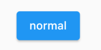
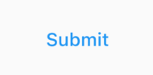
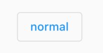

# 3.2 按钮

Material 组件库中提供了多种按钮组件如`ElevatedButton`、`TextButton`、`OutlinedButton`等，它们都是直接或间接对`RawMaterialButton`组件的包装定制，所以他们大多数属性都和`RawMaterialButton`一样。在介绍各个按钮时我们先介绍其默认外观，而按钮的外观大都可以通过属性来自定义，我们在后面统一介绍这些属性。另外，所有 Material 库中的按钮都有如下相同点：

1. 按下时都会有“水波动画”（又称“涟漪动画”，就是点击时按钮上会出现水波扩散的动画）。
2. 有一个`onPressed`属性来设置点击回调，当按钮按下时会执行该回调，如果不提供该回调则按钮会处于禁用状态，禁用状态不响应用户点击。

## 3.2.1 ElevatedButton

`ElevatedButton` 即"漂浮"按钮，它默认带有阴影和灰色背景。按下后，阴影会变大，如图3-6所示：



使用`ElevatedButton`非常简单，如：

```dart
ElevatedButton(
  child: Text("normal"),
  onPressed: () {},
);
```

## 3.2.2 TextButton

`TextButton`即文本按钮，默认背景透明并不带阴影。按下后，会有背景色，如图3-7所示：



使用 TextButton 也很简单，代码如下：

```dart
TextButton(
  child: Text("normal"),
  onPressed: () {},
)
```

## 3.2.3 OutlinedButton

`OutlinedButton`默认有一个边框，不带阴影且背景透明。按下后，边框颜色会变亮、同时出现背景和阴影(较弱)，如图 3-8 所示：



使用`OutlinedButton`也很简单，代码如下：

```dart
OutlinedButton(
  child: Text("normal"),
  onPressed: () {},
)
```

## 3.2.4 IconButton

`IconButton`是一个可点击的Icon，不包括文字，默认没有背景，点击后会出现背景，如图3-9所示：


代码如下：

```dart
IconButton(
  icon: Icon(Icons.thumb_up),
  onPressed: () {},
)
```


## 3.2.5 带图标的按钮

`ElevatedButton`、`TextButton`、`OutlinedButton`都有一个`icon` 构造函数，通过它可以轻松创建带图标的按钮，如图3-10所示：


代码如下：

```dart
ElevatedButton.icon(
  icon: Icon(Icons.send),
  label: Text("发送"),
  onPressed: _onPressed,
),
OutlinedButton.icon(
  icon: Icon(Icons.add),
  label: Text("添加"),
  onPressed: _onPressed,
),
TextButton.icon(
  icon: Icon(Icons.info),
  label: Text("详情"),
  onPressed: _onPressed,
),
```

