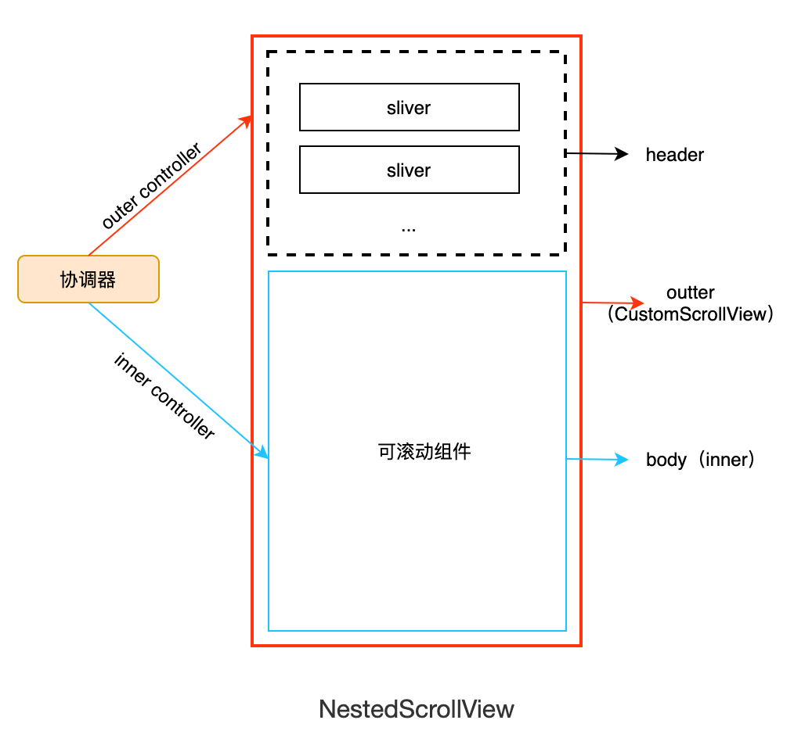

# 6.12 嵌套可滚动组件 NestedScrollView

## 6.12.1 NestedScrollView

上一节中，我们知道 CustomScrollView 只能组合 Sliver，如果有孩子也是一个可滚动组件（通过 SliverToBoxAdapter 嵌入）且它们的滑动方向一致时便不能正常工作。为了解决这个问题，Flutter 中提供了一个NestedScrollView 组件，它的功能是组合（协调）两个可滚动组件，下面我们看看它的定义：

```dart
const NestedScrollView({
  ... //省略可滚动组件的通用属性
  //header，sliver构造器
  required this.headerSliverBuilder,
  //可以接受任意的可滚动组件
  required this.body,
  this.floatHeaderSlivers = false,
}) 
```

我们先看一个简单的示例，需要实现的页面的最终效果如图6-32所示：


页面有三部分组成：

1. 最上面是一个 AppBar，实现导航，要能固定在顶端
2. AppBar 下面是一个 SliverList，可以有任意多个列表项，为了演示，我们指定5个列表项即可。
3. 最下面是一个 ListView。

预期的效果是 SliverList 和 下面的 ListView 的滑动能够统一（而不是在下面ListView 上滑动时只有ListView响应滑动），整个页面在垂直方向是一个整体。实现代码如下：

```dart
Material(
  child: NestedScrollView(
    headerSliverBuilder: (BuildContext context, bool innerBoxIsScrolled) {
      // 返回一个 Sliver 数组给外部可滚动组件。
      return <Widget>[
        SliverAppBar(
          title: const Text('嵌套ListView'),
          pinned: true, // 固定在顶部
          forceElevated: innerBoxIsScrolled,
        ),
        buildSliverList(5), //构建一个 sliverList
      ];
    },
    body: ListView.builder(
      padding: const EdgeInsets.all(8),
      physics: const ClampingScrollPhysics(), //重要
      itemCount: 30,
      itemBuilder: (BuildContext context, int index) {
        return SizedBox(
          height: 50,
          child: Center(child: Text('Item $index')),
        );
      },
    ),
  ),
);
```

NestedScrollView  在逻辑上将可滚动组件分为了 header 和 body 两部分，header 部分我们可以认为是**外部**可滚动组件（outer scroll view），可以认为这个可滚动组件就是 CustomScrollView ，所以它只能接收 Sliver，我们通过`headerSliverBuilder`  来构建一个 Sliver 列表给外部的可滚动组件；而 body 部分可以接收任意的可滚动组件，该可滚动组件称为**内部**可滚动组件 （inner scroll view）。

> Flutter 的源码注释中和文档中会有 outer 和 inner 两个概念，分别指代外部和内部可滚动组件。


## 6.12.2 NestedScrollView 原理

NestedScrollView 的结构图如图6-33所示：



有几点解释：

1. NestedScrollView 整体就是一个 CustomScrollView （实际上是 CustomScrollView 的一个子类）
2. header 和 body 都是 CustomScrollView 的子 Sliver ，注意，虽然 body 是一个 RenderBox，但是它会被包装为 Sliver 。
3. CustomScrollView 将其所有子 Sliver 在逻辑上分为 header 和 body 两部分：header 是前面部分、body 是后面部分。
4. 当 body 是一个可滚动组件时， 它和 CustomScrollView 分别有一个 Scrollable ，由于 body 在 CustomScrollView  的内部，所以称其为内部可滚动组件，称 CustomScrollView 为外部可滚动组件；同时 因为 header 部分是 Sliver，所以没有独立的 Scrollable，滑动时是受 CustomScrollView 的 Scrollable 控制，所以为了区分，可以称 header 为外部可滚动组件（Flutter 文档中是这么约定的）。
5. NestedScrollView 核心功能就是通过一个协调器来协调外部（outer）可滚动组件和内部（inner）可滚动组件的滚动，以使滑动效果连贯统一，协调器的实现原理就是分别给内外可滚动组件分别设置一个 controller，然后通过这两个controller 来协调控制它们的滚动。

综上，在使用 NestedScrollView  有两点需要注意：

1. 要确认内部的可滚动组件（body）的 `physics` 是否需要设置为 `ClampingScrollPhysics`。比如上面的示例运行在 iOS 中时，ListView 如果没有设置为 `ClampingScrollPhysics`，则用户快速滑动到顶部时，会执行一个弹性效果，此时 ListView 就会与 header 显得割裂（滑动效果不统一），所以需要设置。但是，如果 header 中只有一个 SliverAppBar 则不应该加，因为 SliverAppBar 是固定在顶部的，ListView 滑动到顶部时上面已经没有要继续往下滑动的元素了，所以此时出现弹性效果是符合预期的。
2. 内部的可滚动组件（body的）不能设置 `controller` 和 `primary`，这是因为 NestedScrollView 的协调器中已经指定了它的 controller，如果重新设定则协调器将会失效。

## 6.12.3 SliverAppBar

上一节中我们已经使用过 SliverAppBar，但是并没有仔细介绍，因为它最常见的使用场景是在作为 NestedScrollView 的 header， 所以我们在本节介绍。

SliverAppBar 是 AppBar 的Sliver 版，大多数参数都相同，但 SliverAppBar 会有一些特有的功能，下面是 SliverAppBar 特有的一些配置：

```dart
const SliverAppBar({
  this.collapsedHeight, // 收缩起来的高度
  this.expandedHeight,// 展开时的高度
  this.pinned = false, // 是否固定
  this.floating = false, //是否漂浮
  this.snap = false, // 当漂浮时，此参数才有效
  bool forceElevated //导航栏下面是否一直显示阴影
  ...
})
```

- SliverAppBar 在 NestedScrollView 中随着用户的滑动是可以收缩和展开的，因此我们需要分别指定收缩和展开时的高度。
- `pinned` 为` true` 时 SliverAppBar 会固定在 NestedScrollView 的顶部，行为 和 SliverPersistentHeader 的 `pinned`功能一致。
- floating 和 snap：floating 为 true 时，SliverAppBar 不会固定到顶部，当用户向上滑动到顶部时，SliverAppBar 也会滑出可视窗口。当用户反向滑动时，SliverAppBar 的 snap 为 true 时，此时无论 SliverAppBar 已经滑出屏幕多远，都会立即回到屏幕顶部；但如果 snap 为 false，则 SliverAppBar 只有当向下滑到边界时才会重新回到屏幕顶部。这一点和 SliverPersistentHeader 的 `floating` 相似，但不同的是  SliverPersistentHeader 没有 snap 参数，当它的 `floating` 为 true 时，效果是等同于 SliverAppBar 的floating 和 snap 同时为 true 时的效果。

我们可以看到 SliverAppBar 的一些参数和 SliverPersistentHeader 很像，这是因为 SliverAppBar 内部就包含了一个  SliverPersistentHeader 组件，用于实现顶部固定和漂浮效果。

下面我们看一个示例：

```dart
class SnapAppBar extends StatelessWidget {
  const SnapAppBar({Key? key}) : super(key: key);

  @override
  Widget build(BuildContext context) {
    return Scaffold(
      body: NestedScrollView(
        headerSliverBuilder: (BuildContext context, bool innerBoxIsScrolled) {
          return <Widget>[
            // 实现 snap 效果
            SliverAppBar(
              floating: true,
              snap: true,
              expandedHeight: 200,
              forceElevated: innerBoxIsScrolled,
              flexibleSpace: FlexibleSpaceBar(
                background: Image.asset(
                  "./imgs/sea.png",
                  fit: BoxFit.cover,
                ),
              ),
            ),
          ];
        },
        body: Builder(builder: (BuildContext context) {
          return CustomScrollView(
            slivers: <Widget>[
              buildSliverList(100)
            ],
          );
        }),
      ),
    );
  }
}
```

运行后效果如图6-34：


当我们滑动到顶部时，然后反向轻微滑动一点点，这时 SliverAppBar 就会整体回到屏幕顶部，但这时有一个问题，注意图中红色圈出来的部分，我们发现  SliverAppBar 返回到屏幕后将 0 - 4 这几个列表项遮住了！而按照正常的交互逻辑，预期是不能遮住的，因为往下滑时，用户就是为了看上面的内容，SliverAppBar 突然整体回到屏幕后正好遮住了上面的内容，这时，用户不得不继续往下再滑动一些距离，这个体验很不好。

为了解决这个问题，能立马想到的思路就是当 SliverAppBar 在回到屏幕的过程中，底下的列表项也同时往下滑相应的偏移就 OK 了。但是我们要动手时发现了问题，因为无论是想监听 header 的滑动信息和控制 body 的滑动都需要用到内外部可滚动组件的 controller ，而 controller 的持有者是 NestedScrollView 的协调器，我们很难获取取，就算能获取（通过context），那也是 NestedScrollView 的内部逻辑，我们不应在在外部去干涉，这样不符合职责分离模式，是有侵入性的 。 Flutter 的开发者也意识到了这点，于是提供了一个标准的解决方案，我们先看看如何解决，再解释，我们修改上面的代码：

```dart
class SnapAppBar extends StatelessWidget {
  const SnapAppBar({Key? key}) : super(key: key);

  @override
  Widget build(BuildContext context) {
    return Scaffold(
      body: NestedScrollView(
        headerSliverBuilder: (BuildContext context, bool innerBoxIsScrolled) {
          return <Widget>[
            SliverOverlapAbsorber(
              handle: NestedScrollView.sliverOverlapAbsorberHandleFor(context),
              sliver: SliverAppBar(
                floating: true,
                snap: true,
                expandedHeight: 200,
                flexibleSpace: FlexibleSpaceBar(
                  background: Image.asset(
                    "./imgs/sea.png",
                    fit: BoxFit.cover,
                  ),
                ),
                forceElevated: innerBoxIsScrolled,
              ),
            ),
          ];
        },
        body: Builder(builder: (BuildContext context) {
          return CustomScrollView(
            slivers: <Widget>[
              SliverOverlapInjector(
                handle: NestedScrollView.sliverOverlapAbsorberHandleFor(context),
              ),
              buildSliverList(100)
            ],
          );
        }),
      ),
    );
  }
}
```

上面代码运行后问题解决，笔者就不贴图了。需要注意的是和之前的代码相比有两个部分发生了变化：

1. SliverAppBar 用 SliverOverlapAbsorber 包裹了起来，它的作用就是获取 SliverAppBar 返回时遮住内部可滚动组件的部分的长度，这个长度就是 overlap（重叠） 的长度。
2. 在 body 中往 CustomScrollView 的 Sliver列表的最前面插入了一个 SliverOverlapInjector，它会将 SliverOverlapAbsorber 中获取的 overlap 长度应用到内部可滚动组件中。这样在 SliverAppBar 返回时内部可滚动组件也会相应的同步滑动相应的距离。

SliverOverlapAbsorber 和 SliverOverlapInjector 都接收有一个 handle，给它传入的是`NestedScrollView.sliverOverlapAbsorberHandleFor(context)` 。好家伙，名字一个比一个长！但不要被吓到， handle 就是 SliverOverlapAbsorber 和  SliverOverlapInjector 的通信桥梁，即传递 overlap 长度。

以上便是 NestedScrollView 提供的标准解决方案，可能直观上看起来不是很优雅，但笔者站在NestedScrollView 开发者的角度暂时也没有想到更好的方式。不过，幸运的是，这是一个标准方案，有需要直接复制代码即可。

实际上，当 snap 为 true 时，只需要给 SliverAppBar 包裹一个 SliverOverlapAbsorber即可，而无需再给 CustomScrollView 添加 SliverOverlapInjector，因为这种情况 SliverOverlapAbsorber 会自动吸收 overlap，以调整自身的布局高度为 SliverAppBar 的实际高度，这样的话 header 的高度变化后就会自动将 body 向下撑（header 和 body 属于同一个 CustomScrollView），同时，handle 中的 overlap 长度始终 0。**而只有当 SliverAppBar 被 SliverOverlapAbsorber 包裹且为固定模式时**（pinned 为 true ），CustomScrollView 中添加SliverOverlapInjector 才有意义， handle 中的 overlap 长度不为 0。我们可以通过以下代码验证：

```dart
class SnapAppBar2 extends StatefulWidget {
  const SnapAppBar2({Key? key}) : super(key: key);

  @override
  State<SnapAppBar2> createState() => _SnapAppBar2State();
}

class _SnapAppBar2State extends State<SnapAppBar2> {
  // 将handle 缓存
  late SliverOverlapAbsorberHandle handle;

  void onOverlapChanged(){
    // 打印 overlap length
    print(handle.layoutExtent);
  }

  @override
  Widget build(BuildContext context) {
    return Scaffold(
      body: NestedScrollView(
        headerSliverBuilder: (BuildContext context, bool innerBoxIsScrolled) {
          handle = NestedScrollView.sliverOverlapAbsorberHandleFor(context);
          //添加监听前先移除旧的
          handle.removeListener(onOverlapChanged);
          //overlap长度发生变化时打印
          handle.addListener(onOverlapChanged);
          return <Widget>[
            SliverOverlapAbsorber(
              handle: handle,
              sliver: SliverAppBar(
                floating: true,
                snap: true,
                // pinned: true,  // 放开注释，然后看日志
                expandedHeight: 200,
                flexibleSpace: FlexibleSpaceBar(
                  background: Image.asset(
                    "./imgs/sea.png",
                    fit: BoxFit.cover,
                  ),
                ),
                forceElevated: innerBoxIsScrolled,
              ),
            ),
          ];
        },
        body: LayoutBuilder(builder: (BuildContext context,cons) {
          return CustomScrollView(
            slivers: <Widget>[
              SliverOverlapInjector(handle: handle),
              buildSliverList(100)
            ],
          );
        }),
      ),
    );
  }

  @override
  void dispose() {
    // 移除监听器
    handle.removeListener(onOverlapChanged);
    super.dispose();
  }
}
```

我们可以分别查看 snap 模式下和 pinned 模式下控制台的输出即可验证。

综上，笔者还是建议 SliverOverlapAbsorber 和 SliverOverlapInjector 配对使用，这样可以避免我们日后将snap模式改为固定模式后忘记添加 SliverOverlapInjector 而导致bug。


## 6.12.4 嵌套 TabBarView

我们实现商城主页，它有三个Tab，为了获得更大的商品显示空间，我们希望用户向上滑动时 导航栏能够滑出屏幕，当用户向下滑动时，导航栏能迅速回到屏幕，因为向下滑动时可能是用户想看之前的商品，也可能是用户向找到导航栏返回。我们要实现的页面效果如下（初始状态）：

```dart
class NestedTabBarView1 extends StatelessWidget {
  const NestedTabBarView1({Key? key}) : super(key: key);

  @override
  Widget build(BuildContext context) {
    final _tabs = <String>['猜你喜欢', '今日特价', '发现更多'];
    // 构建 tabBar
    return DefaultTabController(
      length: _tabs.length, // tab的数量.
      child: Scaffold(
        body: NestedScrollView(
          headerSliverBuilder: (BuildContext context, bool innerBoxIsScrolled) {
            return <Widget>[
              SliverOverlapAbsorber(
                handle: NestedScrollView.sliverOverlapAbsorberHandleFor(context),
                sliver: SliverAppBar(
                  title: const Text('商城'),
                  floating: true,
                  snap: true,
                  forceElevated: innerBoxIsScrolled,
                  bottom: TabBar(
                    tabs: _tabs.map((String name) => Tab(text: name)).toList(),
                  ),
                ),
              ),
            ];
          },
          body: TabBarView(
            children: _tabs.map((String name) {
              return Builder(
                builder: (BuildContext context) {
                  return CustomScrollView(
                    key: PageStorageKey<String>(name),
                    slivers: <Widget>[
                      SliverOverlapInjector(
                        handle: NestedScrollView.sliverOverlapAbsorberHandleFor(context),
                      ),
                      SliverPadding(
                        padding: const EdgeInsets.all(8.0),
                        sliver: buildSliverList(50),
                      ),
                    ],
                  );
                },
              );
            }).toList(),
          ),
        ),
      ),
    );
  }
}
```

