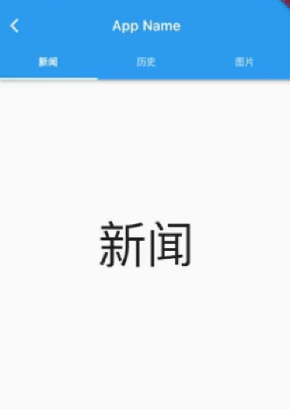

# 6.9 TabBarView

TabBarView 是 Material 组件库中提供了 Tab 布局组件，通常和 TabBar 配合使用。

## 6.9.1 TabBarView 

TabBarView 封装了 PageView，它的构造方法很简单

```dart
 TabBarView({
  Key? key,
  required this.children, // tab 页
  this.controller, // TabController
  this.physics,
  this.dragStartBehavior = DragStartBehavior.start,
}) 
```

TabController 用于监听和控制 TabBarView 的页面切换，通常和 TabBar 联动。如果没有指定，则会在组件树中向上查找并使用最近的一个 `DefaultTabController` 。

## 6.9.2 TabBar

TabBar 为 TabBarView 的导航标题，如图6-20所示：


TabBar 有很多配置参数，通过这些参数我们可以定义 TabBar 的样式，很多属性都是在配置 indicator 和 label，拿上图来举例，Label 是每个Tab 的文本，indicator 指 “历史” 下面的白色下划线。

```dart
const TabBar({
  Key? key,
  required this.tabs, // 具体的 Tabs，需要我们创建
  this.controller,
  this.isScrollable = false, // 是否可以滑动
  this.padding,
  this.indicatorColor,// 指示器颜色，默认是高度为2的一条下划线
  this.automaticIndicatorColorAdjustment = true,
  this.indicatorWeight = 2.0,// 指示器高度
  this.indicatorPadding = EdgeInsets.zero, //指示器padding
  this.indicator, // 指示器
  this.indicatorSize, // 指示器长度，有两个可选值，一个tab的长度，一个是label长度
  this.labelColor, 
  this.labelStyle,
  this.labelPadding,
  this.unselectedLabelColor,
  this.unselectedLabelStyle,
  this.mouseCursor,
  this.onTap,
  ...
}) 
```

TabBar 通常位于 AppBar 的底部，它也可以接收一个 TabController ，如果需要和 TabBarView 联动， TabBar 和 TabBarView  使用同一个 TabController 即可，注意，联动时 TabBar 和 TabBarView 的孩子数量需要一致。如果没有指定 `controller`，则会在组件树中向上查找并使用最近的一个 `DefaultTabController` 。另外我们需要创建需要的 tab 并通过 `tabs` 传给 TabBar， tab 可以是任何 Widget，不过Material 组件库中已经实现了一个 Tab 组件，我们一般都会直接使用它：

```dart
const Tab({
  Key? key,
  this.text, //文本
  this.icon, // 图标
  this.iconMargin = const EdgeInsets.only(bottom: 10.0),
  this.height,
  this.child, // 自定义 widget
})
```

注意，`text` 和 `child` 是互斥的，不能同时制定。

## 6.9.3 实例

下面我们看一个例子：

```dart
class TabViewRoute1 extends StatefulWidget {
  @override
  _TabViewRoute1State createState() => _TabViewRoute1State();
}

class _TabViewRoute1State extends State<TabViewRoute1>
    with SingleTickerProviderStateMixin {
  late TabController _tabController;
  List tabs = ["新闻", "历史", "图片"];

  @override
  void initState() {
    super.initState();
    _tabController = TabController(length: tabs.length, vsync: this);
  }

  @override
  Widget build(BuildContext context) {
    return Scaffold(
      appBar: AppBar(
        title: Text("App Name"),
        bottom: TabBar(
          controller: _tabController,
          tabs: tabs.map((e) => Tab(text: e)).toList(),
        ),
      ),
      body: TabBarView( //构建
        controller: _tabController,
        children: tabs.map((e) {
          return KeepAliveWrapper(
            child: Container(
              alignment: Alignment.center,
              child: Text(e, textScaleFactor: 5),
            ),
          );
        }).toList(),
      ),
    );
  }
  
  @override
  void dispose() {
    // 释放资源
    _tabController.dispose();
    super.dispose();
  }
}
```

运行后效果如图6-21所示：



滑动页面时顶部的 Tab 也会跟着动，点击顶部 Tab 时页面也会跟着切换。为了实现 TabBar 和 TabBarView 的联动，我们显式创建了一个 TabController，由于 TabController 又需要一个 TickerProvider （vsync 参数）， 我们又混入了 SingleTickerProviderStateMixin；由于 TabController 中会执行动画，持有一些资源，所以我们在页面销毁时必须得释放资源（dispose）。综上，我们发现创建 TabController 的过程还是比较复杂，实战中，如果需要 TabBar 和 TabBarView 联动，通常会创建一个 DefaultTabController 作为它们共同的父级组件，这样它们在执行时就会从组件树向上查找，都会使用我们指定的这个 DefaultTabController。我们修改后的实现如下：

```dart
class TabViewRoute2 extends StatelessWidget {
  @override
  Widget build(BuildContext context) {
    List tabs = ["新闻", "历史", "图片"];
    return DefaultTabController(
      length: tabs.length,
      child: Scaffold(
        appBar: AppBar(
          title: Text("App Name"),
          bottom: TabBar(
            tabs: tabs.map((e) => Tab(text: e)).toList(),
          ),
        ),
        body: TabBarView( //构建
          children: tabs.map((e) {
            return KeepAliveWrapper(
              child: Container(
                alignment: Alignment.center,
                child: Text(e, textScaleFactor: 5),
              ),
            );
          }).toList(),
        ),
      ),
    );
  }
}
```

可以看到我们无需去手动管理 Controller 的生命周期，也不需要提供 SingleTickerProviderStateMixin，同时也没有其他的状态需要管理，也就不需要用 StatefulWidget 了，这样简单很多。

### 页面缓存

因为TabBarView 内部封装了 PageView，如果要缓存页面，可以参考  PageView 一节中关于页面缓存的介绍。
