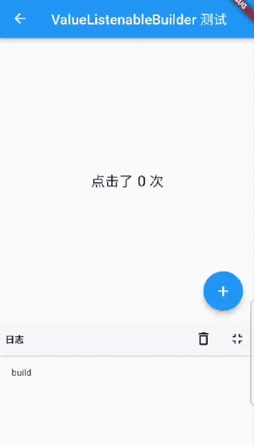

# 7.5 按需rebuild（ValueListenableBuilder）

## 7.5.1 ValueListenableBuilder

InheritedWidget 提供一种在 widget 树中**从上到下**共享数据的方式，但是也有很多场景数据流向并非从上到下，比如从下到上或者横向等。为了解决这个问题，Flutter 提供了一个 ValueListenableBuilder 组件，它的功能是监听一个数据源，如果数据源发生变化，则会重新执行其 builder，定义如下：

```dart
const ValueListenableBuilder({
  Key? key,
  required this.valueListenable, // 数据源，类型为ValueListenable<T>
  required this.builder, // builder
  this.child,
}
```

- valueListenable：类型为 `ValueListenable<T>`，表示一个可监听的数据源。
- builder：数据源发生变化通知时，会重新调用 builder 重新 build 子组件树。
- child: builder 中每次都会重新构建整个子组件树，如果子组件树中有一些不变的部分，可以传递给child，child 会作为builder的第三个参数传递给 builder，通过这种方式就可以实现组件缓存，原理和AnimatedBuilder 第三个 child 相同。

可以发现 ValueListenableBuilder 和数据流向是无关的，只要数据源发生变化它就会重新构建子组件树，因此可以实现任意流向的数据共享。

## 7.5.2 实例

我们依然实现一个计数器，点击

```dart
class ValueListenableRoute extends StatefulWidget {
  const ValueListenableRoute({Key? key}) : super(key: key);

  @override
  State<ValueListenableRoute> createState() => _ValueListenableState();
}

class _ValueListenableState extends State<ValueListenableRoute> {
  // 定义一个ValueNotifier，当数字变化时会通知 ValueListenableBuilder
  final ValueNotifier<int> _counter = ValueNotifier<int>(0);
  static const double textScaleFactor = 1.5;

  @override
  Widget build(BuildContext context) {
    // 添加 + 按钮不会触发整个 ValueListenableRoute 组件的 build
    print('build');
    return Scaffold(
      appBar: AppBar(title: Text('ValueListenableBuilder 测试')),
      body: Center(
        child: ValueListenableBuilder<int>(
          builder: (BuildContext context, int value, Widget? child) {
            // builder 方法只会在 _counter 变化时被调用
            return Row(
              mainAxisAlignment: MainAxisAlignment.center,
              children: <Widget>[
                child!,
                Text('$value 次',textScaleFactor: textScaleFactor),
              ],
            );
          },
          valueListenable: _counter,
          // 当子组件不依赖变化的数据，且子组件收件开销比较大时，指定 child 属性来缓存子组件非常有用
          child: const Text('点击了 ', textScaleFactor: textScaleFactor),
        ),
      ),
      floatingActionButton: FloatingActionButton(
        child: const Icon(Icons.add),
        // 点击后值 +1，触发 ValueListenableBuilder 重新构建
        onPressed: () => _counter.value += 1,
      ),
    );
  }
}
```

运行后连续点击两次 + 按钮效果如图7-8所示：



可以看见，功能正常实现了，同时控制台只在页面打开时 build 了一次，点击 + 按钮的时候只是ValueListenableBuilder 重新构建了子组件树，而整个页面并没有重新 build ，因此日志面板只打印了一次 "build" 。因此我们有一个建议就是：**尽可能让 ValueListenableBuilder 只构建依赖数据源的widget，这样的话可以缩小重新构建的范围，也就是说 ValueListenableBuilder 的拆分粒度应该尽可能细**。

## 7.5.3 总结

关于 ValueListenableBuilder 有两点需要牢记：

1. 和数据流向无关，可以实现任意流向的数据共享。
2. 实践中，ValueListenableBuilder 的拆分粒度应该尽可能细，可以提高性能。

