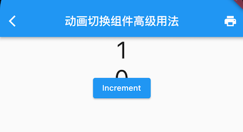

# 9.7 动画过渡组件

为了表述方便，本书约定，将在Widget属性发生变化时会执行过渡动画的组件统称为”动画过渡组件“，而动画过渡组件最明显的一个特征就是它会在内部自管理`AnimationController`。我们知道，为了方便使用者可以自定义动画的曲线、执行时长、方向等，在前面介绍过的动画封装方法中，通常都需要使用者自己提供一个`AnimationController`对象来自定义这些属性值。但是，如此一来，使用者就必须得手动管理`AnimationController`，这又会增加使用的复杂性。因此，如果也能将`AnimationController`进行封装，则会大大提高动画组件的易用性。

## 9.7.1 自定义动画过渡组件

我们要实现一个`AnimatedDecoratedBox`，它可以在`decoration`属性发生变化时，从旧状态变成新状态的过程可以执行一个过渡动画。根据前面所学的知识，我们实现了一个`AnimatedDecoratedBox1`组件：

```dart
class AnimatedDecoratedBox1 extends StatefulWidget {
  const AnimatedDecoratedBox1({
    Key? key,
    required this.decoration,
    required this.child,
    this.curve = Curves.linear,
    required this.duration,
    this.reverseDuration,
  }) : super(key: key);

  final BoxDecoration decoration;
  final Widget child;
  final Duration duration;
  final Curve curve;
  final Duration? reverseDuration;

  @override
  _AnimatedDecoratedBox1State createState() => _AnimatedDecoratedBox1State();
}

class _AnimatedDecoratedBox1State extends State<AnimatedDecoratedBox1>
    with SingleTickerProviderStateMixin {
  @protected
  AnimationController get controller => _controller;
  late AnimationController _controller;

  Animation<double> get animation => _animation;
  late Animation<double> _animation;

  late DecorationTween _tween;

  @override
  Widget build(BuildContext context) {
    return AnimatedBuilder(
      animation: _animation,
      builder: (context, child) {
        return DecoratedBox(
          decoration: _tween.animate(_animation).value,
          child: child,
        );
      },
      child: widget.child,
    );
  }

  @override
  void initState() {
    super.initState();
    _controller = AnimationController(
      duration: widget.duration,
      reverseDuration: widget.reverseDuration,
      vsync: this,
    );
    _tween = DecorationTween(begin: widget.decoration);
    _updateCurve();
  }

  void _updateCurve() {
    _animation = CurvedAnimation(parent: _controller, curve: widget.curve);
  }

  @override
  void didUpdateWidget(AnimatedDecoratedBox1 oldWidget) {
    super.didUpdateWidget(oldWidget);
    if (widget.curve != oldWidget.curve) _updateCurve();
    _controller.duration = widget.duration;
    _controller.reverseDuration = widget.reverseDuration;
    //正在执行过渡动画
    if (widget.decoration != (_tween.end ?? _tween.begin)) {
      _tween
        ..begin = _tween.evaluate(_animation)
        ..end = widget.decoration;

      _controller
        ..value = 0.0
        ..forward();
    }
  }

  @override
  void dispose() {
    _controller.dispose();
    super.dispose();
  }
}
```

下面我们来使用`AnimatedDecoratedBox1`来实现按钮点击后背景色从蓝色过渡到红色的效果：

```dart
Color _decorationColor = Colors.blue;
var duration = Duration(seconds: 1);
...//省略无关代码
AnimatedDecoratedBox1(
  duration: duration,
  decoration: BoxDecoration(color: _decorationColor),
  child: TextButton(
    onPressed: () {
      setState(() {
        _decorationColor = Colors.red;
      });
    },
    child: const Text(
      "AnimatedDecoratedBox",
      style: TextStyle(color: Colors.white),
    ),
  ),
)
```

点击前效果如图9-7所示，点击后截取了过渡过程的一帧如图9-8所示： 

点击后，按钮背景色会从蓝色向红色过渡，图9-9是过渡过程中的一帧，有点偏紫色，整个过渡动画结束后背景会变为红色。

上面的代码虽然实现了我们期望的功能，但是代码却比较复杂。稍加思考后，我们就可以发现，`AnimationController`的管理以及Tween更新部分的代码都是可以抽象出来的，如果我们这些通用逻辑封装成基类，那么要实现动画过渡组件只需要继承这些基类，然后定制自身不同的代码（比如动画每一帧的构建方法）即可，这样将会简化代码。

为了方便开发者来实现动画过渡组件的封装，Flutter提供了一个`ImplicitlyAnimatedWidget`抽象类，它继承自StatefulWidget，同时提供了一个对应的`ImplicitlyAnimatedWidgetState`类，`AnimationController`的管理就在`ImplicitlyAnimatedWidgetState`类中。开发者如果要封装动画，只需要分别继承`ImplicitlyAnimatedWidget`和`ImplicitlyAnimatedWidgetState`类即可，下面我们演示一下具体如何实现。

我们需要分两步实现：

1. 继承`ImplicitlyAnimatedWidget`类。

   ```dart
   class AnimatedDecoratedBox extends ImplicitlyAnimatedWidget {
     const AnimatedDecoratedBox({
       Key? key,
       required this.decoration,
       required this.child,
       Curve curve = Curves.linear,
       required Duration duration,
     }) : super(
             key: key,
             curve: curve,
             duration: duration,
           );
     final BoxDecoration decoration;
     final Widget child;
   
     @override
     _AnimatedDecoratedBoxState createState() {
       return _AnimatedDecoratedBoxState();
     }
   }
   ```
   
   其中`curve`、`duration`、`reverseDuration`三个属性在`ImplicitlyAnimatedWidget `中已定义。 可以看到`AnimatedDecoratedBox`类和普通继承自`StatefulWidget`的类没有什么不同。

2. State类继承自`AnimatedWidgetBaseState`（该类继承自`ImplicitlyAnimatedWidgetState`类）。

   ```dart
   class _AnimatedDecoratedBoxState
       extends AnimatedWidgetBaseState<AnimatedDecoratedBox> {
     late DecorationTween _decoration;
   
     @override
     Widget build(BuildContext context) {
       return DecoratedBox(
         decoration: _decoration.evaluate(animation),
         child: widget.child,
       );
     }
   
     @override
     void forEachTween(TweenVisitor<dynamic> visitor) {
       _decoration = visitor(
         _decoration,
         widget.decoration,
         (value) => DecorationTween(begin: value),
       ) as DecorationTween;
     }
   }
   ```
   
   可以看到我们实现了` build`和`forEachTween`两个方法。在动画执行过程中，每一帧都会调用`build`方法（调用逻辑在`ImplicitlyAnimatedWidgetState`中），所以在`build`方法中我们需要构建每一帧的`DecoratedBox`状态，因此得算出每一帧的`decoration` 状态，这个我们可以通过` _decoration.evaluate(animation)` 来算出，其中`animation`是`ImplicitlyAnimatedWidgetState`基类中定义的对象，`_decoration`是我们自定义的一个`DecorationTween`类型的对象，那么现在的问题就是它是在什么时候被赋值的呢？要回答这个问题，我们就得搞清楚什么时候需要对`_decoration`赋值。我们知道`_decoration`是一个Tween，而Tween的主要职责就是定义动画的起始状态（begin）和终止状态(end)。对于`AnimatedDecoratedBox`来说，`decoration`的终止状态就是用户传给它的值，而起始状态是不确定的，有以下两种情况：
   
   1. `AnimatedDecoratedBox`首次build，此时直接将其`decoration`值置为起始状态，即`_decoration`值为`DecorationTween(begin: decoration)` 。
   2. `AnimatedDecoratedBox`的`decoration`更新时，则起始状态为`_decoration.animate(animation)`，即`_decoration`值为`DecorationTween(begin: _decoration.animate(animation)，end:decoration)`。
   

现在`forEachTween`的作用就很明显了，它正是用于来更新Tween的初始值的，在上述两种情况下会被调用，而开发者只需重写此方法，并在此方法中更新Tween的起始状态值即可。而一些更新的逻辑被屏蔽在了`visitor`回调，我们只需要调用它并给它传递正确的参数即可，`visitor`方法签名如下：

```dart
 Tween<T> visitor(
   Tween<T> tween, //当前的tween，第一次调用为null
   T targetValue, // 终止状态
   TweenConstructor<T> constructor，//Tween构造器，在上述三种情况下会被调用以更新tween
 );
```

可以看到，通过继承`ImplicitlyAnimatedWidget`和`ImplicitlyAnimatedWidgetState`类可以快速的实现动画过渡组件的封装，这和我们纯手工实现相比，代码简化了很多。

> 如果读者还有疑惑，建议查看`ImplicitlyAnimatedWidgetState`的源码并结合本示例代码对比理解。

## 9.7.2 Flutter预置的动画过渡组件

Flutter SDK中也预置了很多动画过渡组件，实现方式和大都和`AnimatedDecoratedBox`差不多，如表9-1所示：

| 组件名                   | 功能                                                         |
| ------------------------ | ------------------------------------------------------------ |
| AnimatedPadding          | 在padding发生变化时会执行过渡动画到新状态                    |
| AnimatedPositioned       | 配合Stack一起使用，当定位状态发生变化时会执行过渡动画到新的状态。 |
| AnimatedOpacity          | 在透明度opacity发生变化时执行过渡动画到新状态                |
| AnimatedAlign            | 当`alignment`发生变化时会执行过渡动画到新的状态。            |
| AnimatedContainer        | 当Container属性发生变化时会执行过渡动画到新的状态。          |
| AnimatedDefaultTextStyle | 当字体样式发生变化时，子组件中继承了该样式的文本组件会动态过渡到新样式。 |

<center>表9-1：Flutter预置的动画过渡组件</center>
下面我们通过一个示例来感受一下这些预置的动画过渡组件效果：

```dart
import 'package:flutter/material.dart';

class AnimatedWidgetsTest extends StatefulWidget {
  const AnimatedWidgetsTest({Key? key}) : super(key: key);

  @override
  _AnimatedWidgetsTestState createState() => _AnimatedWidgetsTestState();
}

class _AnimatedWidgetsTestState extends State<AnimatedWidgetsTest> {
  double _padding = 10;
  var _align = Alignment.topRight;
  double _height = 100;
  double _left = 0;
  Color _color = Colors.red;
  TextStyle _style = const TextStyle(color: Colors.black);
  Color _decorationColor = Colors.blue;
  double _opacity = 1;

  @override
  Widget build(BuildContext context) {
    var duration = const Duration(milliseconds: 400);
    return SingleChildScrollView(
      child: Column(
        children: <Widget>[
          ElevatedButton(
            onPressed: () {
              setState(() {
                _padding = 20;
              });
            },
            child: AnimatedPadding(
              duration: duration,
              padding: EdgeInsets.all(_padding),
              child: const Text("AnimatedPadding"),
            ),
          ),
          SizedBox(
            height: 50,
            child: Stack(
              children: <Widget>[
                AnimatedPositioned(
                  duration: duration,
                  left: _left,
                  child: ElevatedButton(
                    onPressed: () {
                      setState(() {
                        _left = 100;
                      });
                    },
                    child: const Text("AnimatedPositioned"),
                  ),
                )
              ],
            ),
          ),
          Container(
            height: 100,
            color: Colors.grey,
            child: AnimatedAlign(
              duration: duration,
              alignment: _align,
              child: ElevatedButton(
                onPressed: () {
                  setState(() {
                    _align = Alignment.center;
                  });
                },
                child: const Text("AnimatedAlign"),
              ),
            ),
          ),
          AnimatedContainer(
            duration: duration,
            height: _height,
            color: _color,
            child: TextButton(
              onPressed: () {
                setState(() {
                  _height = 150;
                  _color = Colors.blue;
                });
              },
              child: const Text(
                "AnimatedContainer",
                style: TextStyle(color: Colors.white),
              ),
            ),
          ),
          AnimatedDefaultTextStyle(
            child: GestureDetector(
              child: const Text("hello world"),
              onTap: () {
                setState(() {
                  _style = const TextStyle(
                    color: Colors.blue,
                    decorationStyle: TextDecorationStyle.solid,
                    decorationColor: Colors.blue,
                  );
                });
              },
            ),
            style: _style,
            duration: duration,
          ),
          AnimatedOpacity(
            opacity: _opacity,
            duration: duration,
            child: TextButton(
              style: ButtonStyle(
                  backgroundColor: MaterialStateProperty.all(Colors.blue)),
              onPressed: () {
                setState(() {
                  _opacity = 0.2;
                });
              },
              child: const Text(
                "AnimatedOpacity",
                style: TextStyle(color: Colors.white),
              ),
            ),
          ),
          AnimatedDecoratedBox1(
            duration: Duration(
                milliseconds: _decorationColor == Colors.red ? 400 : 2000),
            decoration: BoxDecoration(color: _decorationColor),
            child: Builder(builder: (context) {
              return TextButton(
                onPressed: () {
                  setState(() {
                    _decorationColor = _decorationColor == Colors.blue
                        ? Colors.red
                        : Colors.blue;
                  });
                },
                child: const Text(
                  "AnimatedDecoratedBox toggle",
                  style: TextStyle(color: Colors.white),
                ),
              );
            }),
          )
        ].map((e) {
          return Padding(
            padding: const EdgeInsets.symmetric(vertical: 16),
            child: e,
          );
        }).toList(),
      ),
    );
  }
}
```

运行后效果如图9-9所示：


读者可以点击一下相应组件来查看一下实际的运行效果。
